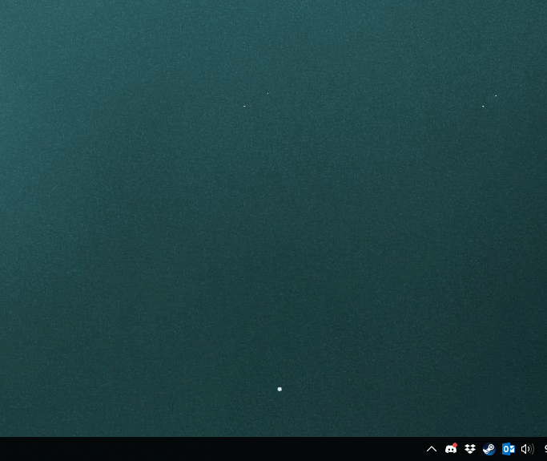

# Audio Band
*This is still a work in progress!*

Audio Band allows you to display song information in the taskbar.

## Features
- Displays song information - album art, artist, title, progress
- Control your music - play/pause, previous/next
- Add support for your music player of choice through plugins

## Installation
There is currently no installer available, however there are prereleases in the [Release](https://github.com/dsafa/audio-band/releases) page.

## Usage
1. Right click on the taskbar and select `Audio Band` from the toolbars submenu.
2. Right click on the Audio Band toolbar and select an audio source
_images here_

### Current Supported Audio Sources
- Sotify

## Building
This project uses C# 7 features so a compatible compiler is required.

## Contributing
Help is appreciated
- Ask questions, report bugs, suggest features in issues
- Send pull requests

## Screenshots

## License
[LICENSE](https://github.com/dsafa/audio-band/blob/master/LICENSE)
[THIRD PARTY](https://github.com/dsafa/audio-band/blob/master/LICENSE-3RD-PARTY)