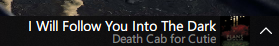
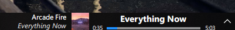
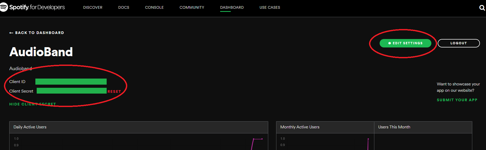

# Audio Band
Audio Band allows you to display song information in the taskbar.

## Features
- Displays song information - album art, artist, title, progress
- Control your music - play/pause, previous/next
- Add support for your music player of choice through plugins
- Customizable

## Screenshots

## Installation
There is currently no installer available, however there are prereleases in the [Release](https://github.com/dsafa/audio-band/releases) page that come with a script to install manually.

## Usage
1. If nothing appears on your toolbar after installation, right click on the taskbar and select `Audio Band` from the toolbars submenu.
2. Right click on the Audio Band toolbar and select an audio source (ex. Spotify)

**IMPORTANT** If nothing happens after selecting `Audio Band` from the toolbars menu or if there are no options in the `Audio Source` menu, some files are being blocked by windows. To fix it, right click the files -> properties and click unblock. If there are still problems, feel free to post an issue.

### Current Supported Audio Sources
- Spotify (see below for setup instructions and issues)

### Spotify Setup
1. Login to the [Spotify dashboard](https://developer.spotify.com/dashboard/login) and create a new App. Fill in the details, you can name it whatever you want. This app will be just for AudioBand.
2. Go to the app you created and click `Edit Settings`. Add `http://localhost` as a callback url.
3. Right click anywhere in the toolbar > Audio Band Settings > Audio Source Settings and fill in the fields `Spotify Client Id` and `Spotify Client Secret`. You can find them in the same dashboard page for the Spotify app you created.
4. Your browser should open asking you to login and allow your spotify app to access your currently playing songs.
5. Sign-in and accept and it should now display song information (make sure spotify is selected as the audio source).

#### Spotify Issues
- The browser will show up everytime audioband starts asking you to log into Spotify. Even if you select remember me, a browser window still opens. This will be fixed in a later version.
- The song progress will be out of sync if you change the song's progress. This is due to current limitations making the song progress being tracked locally. This can be fixed if you pause and play again or go to a different song.
- The first time you open up Spotify, the current song may not be displayed. This is because Spotify doesn't report any song information if you have no devices playing songs. Just start playing a song and it will start displaying.

## Building
This project uses C# 7 features so a compatible compiler is required.

## Contributing
Help is appreciated, but the code base is messy right now.
- Ask questions, report bugs, suggest features in issues
- Send pull requests

## License
[LICENSE](https://github.com/dsafa/audio-band/blob/master/LICENSE)

[THIRD PARTY](https://github.com/dsafa/audio-band/blob/master/LICENSE-3RD-PARTY)