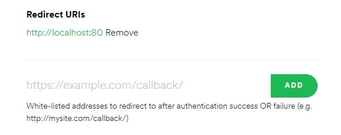

# Audio Band
Audio Band allows you to display song information in the taskbar.

## Features
- Displays song information - album art, artist, title, progress
- Control your music - play/pause, previous/next
- Add support for your music player of choice through plugins
- Customizable

## Screenshots

# Table of contents
1. [Installation](#installation)
2. [Usage](#usage)
3. [Plugins](#audiosources)
   1. [Spotify](#spotify-setup)
   2. [iTunes](#itunes)
   3. [MusicBee](#musicbee)
4. [Customization](#customization)

## Installation
There is currently no installer available, however there are prereleases in the [Release](https://github.com/dsafa/audio-band/releases) page that come with a script to install manually.

## Usage
1. If nothing appears on your toolbar after installation, right click on the taskbar and select `Audio Band` from the toolbars submenu.
2. Right click on the Audio Band toolbar and select an audio source (ex. Spotify)

**IMPORTANT** If nothing happens after selecting `Audio Band` from the toolbars menu or if there are no options in the `Audio Source` menu, some files are being blocked by windows. To fix it, run `unblock.ps1` with powershell. If that doesn't work you can manually fix it by right clicking the files -> properties and clicking unblock. If there are still problems, feel free to post an issue.

## Current Supported Audio Sources (see below for setup instructions and issues)
- Spotify
- iTunes
- MusicBee

### Spotify Setup
1. Login to the [Spotify dashboard](https://developer.spotify.com/dashboard/login) and create a new App. Fill in the details, you can name it whatever you want. This app will be just for AudioBand.
2. Go to the app you created and click `Edit Settings`. Add `http://localhost:80` as a callback url.
    1. You can use a different port for the local webserver (see next step)
3. Right click anywhere in the toolbar > Audio Band Settings > Audio Source Settings and fill in the fields `Spotify Client Id` and `Spotify Client Secret`. You can find them in the same dashboard page for the Spotify app you created.
    1. You can also change the `Callback Port` if needed.
4. Your browser should open asking you to login and allow your spotify app to access your currently playing songs.
5. Sign-in and accept and it should now display song information (make sure spotify is selected as the audio source).

#### Spotify Issues
- The first time you open up Spotify, the current song may not be displayed. This is because Spotify doesn't report any song information if you have no devices playing songs. Just start playing a song and it will start displaying.

### iTunes
- iTunes will open when the audio source is selected, and cannot be changed (as far as I know).

### MusicBee
- Make sure that the [Musicbee IPC plugin](https://getmusicbee.com/addons/plugins/138/musicbeeipc/) is installed for MusicBee. Use this [link](https://getmusicbee.com/forum/index.php?topic=11492.0) if that link doesn't work.

## Customization
Right click audio band and select `Audio Band Settings` and a new window will appear where you can do your customization. A description of the options can be found [here](https://github.com/dsafa/audio-band/wiki/Audio-Band-settings). *In app help coming soon*

## Building
This project uses C# 7 features so a compatible compiler is required.

## Contributing
Help is appreciated
- Ask questions, report bugs, suggest features in issues
- Send pull requests

## License
[LICENSE](https://github.com/dsafa/audio-band/blob/master/LICENSE)

[THIRD PARTY](https://github.com/dsafa/audio-band/blob/master/LICENSE-3RD-PARTY)